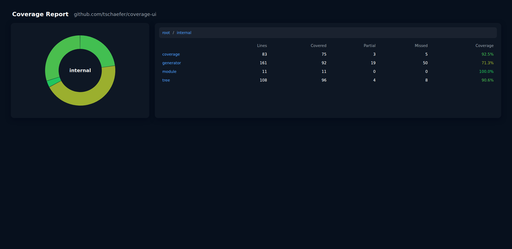
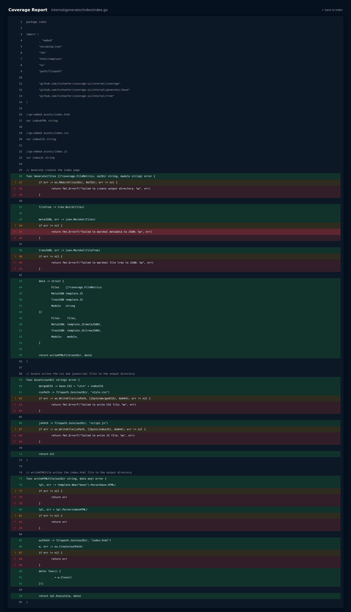

# gocover-ui

[](https://github.com/tschaefer/gocover-ui/releases)

[](https://goreportcard.com/report/github.com/tschaefer/gocover-ui)
[](https://codecov.io/gh/tschaefer/gocover-ui)
[](https://github.com/tschaefer/gocover-ui/graphs/contributors)
[](./LICENSE)


Generate a modern, interactive HTML coverage report from a Go coverage
profile file.

`gocover-ui` computes per-line coverage by mapping profile blocks to lines.
If a line is covered by multiple blocks and only some of those blocks are
covered, that line is considered "partial". Uncovered lines are "missed", and
fully covered lines are "covered".

## Features:
- Index page with a file list and stats columns:
  - lines total
  - lines covered
  - lines partial
  - lines missed
  - coverage % (red/yellow/green color band)

- Ring (donut) chart that shows all files as arcs; arc length is proportional
  to tracked lines and segment color reflects the file coverage band.



- Per-file detail pages with an editor-style view that shows line numbers and
  colors each line according to coverage:
  - red = missed
  - yellow = partial
  - green = fully covered
- Line highighting on click to easily share specific lines.



## Usage:

Run `gocover-ui` on a Go source tree with a proper module and the related
coverage profile file.

```bash
go test -coverprofile=coverage.out ./...
gocover-ui -profile.file=coverage.out -src.root=. -out.dir=coverage
open coverage/index.html
```

Flags:
- `-clean`
    clean output directory before generating files (default false)
- `-out string`
    output directory for generated html files (default "coverage")
- `-profile string`
    coverage profile file (default "coverage.out")
- `-src string`
    source root directory on disk; default `.` (current directory)
- `-version`
    print version and exit

## Contributing

Contributions are welcome! Please fork the repository and submit a pull request.
For major changes, open an issue first to discuss your proposal.

Ensure that your code adheres to the existing style and includes appropriate
tests.

## License

This project is licensed under the [MIT License](LICENSE).
